# XTB S.A. Equity Risk Analysis

A comprehensive risk analysis of **XTB S.A.** (`XTB.WA`) listed on the Warsaw Stock Exchange (GPW), covering the period **2018–2025**. Developed for the course **Enterprise Risk Management** (*Zarządzanie Ryzykiem w Przedsiębiorstwie*).

The repository spans five project stages (`prez3`–`prez6`), a hybrid **LSTM + FHS** model, GPW portfolio optimization, FX hedging with GPW futures, and an integrated summary in `podsumowanie.ipynb`.

---

## Table of Contents

- [Context and Objectives](#context-and-objectives)
- [Key Findings](#key-findings)
- [Project Workflow](#project-workflow)
- [Visual Summary](#visual-summary)
- [Repository Structure](#repository-structure)
- [Methods and Scope](#methods-and-scope)
- [Requirements](#requirements)
- [Installation and Usage](#installation-and-usage)
- [Data Sources](#data-sources)
- [Author](#author)

---

## Context and Objectives

XTB S.A. is a global financial broker whose shares evolved from a smaller issuer to a **WIG20** constituent during the study period. Elevated volatility (annual σ ≈ 47% vs. ≈ 22% for WIG20), negative skewness (−0.47), and high excess kurtosis (≈ 25) call for dynamic methods that capture **volatility clustering** and **fat tails** in return distributions.

**Project goals:**

1. Characterize risk in XTB.WA and related variables (FX, CFD).
2. Compare **VaR**, **ES**, and **EVaR** with regulatory backtesting.
3. Model extremes using **EVT** (GEV, GPD).
4. Optimize a GPW equity portfolio (**Markowitz**, single-index model).
5. Build a hybrid **LSTM + Filtered Historical Simulation (FHS)** model for dynamic VaR.
6. Hedge **EUR/PLN** and **USD/PLN** exposure with **FEUR** and **FUSD** futures on GPW.

---

## Key Findings

| Area | Result |
|------|--------|
| Return distribution | No parametric distribution passes the K-S test; best fit: Johnson SU, Student's *t* |
| Static VaR | Normal VaR **understates** 99% VaR by ~20% vs. *t*-distribution and historical simulation |
| Backtesting (rolling, W=500) | **FHS GARCH** and **EWMA + Hill** pass Kupiec and Christoffersen tests; Parametric Normal triggers excessive breaches (Basel red zone) |
| EVT | GPD (POT) estimates extreme quantiles (99.9%) better than Block Maxima (GEV) |
| LSTM-FHS | Best calibration in Kupiec/Christoffersen tests (p ≈ 1.0 at 95% and 99%) |
| GPW portfolio | MVP (Sharpe ≈ 0.79) vs. market portfolio (Sharpe ≈ 1.26); 13-stock diversification >> 2-asset portfolio |
| FX hedging | GPW futures reduce 1-day 99% VaR from ~4.0M PLN to ~0.014M PLN; XTB platform CFDs **do not hedge** group exposure (net zero) |

**Recommended risk stack for XTB:**

| Use case | Method |
|----------|--------|
| Daily reporting | **FHS GARCH** |
| Capital requirement (IMA) | **LSTM-FHS** / **EWMA + Hill** |
| Stress testing (Pillar II) | **GPD / POT** |
| Strategic allocation | **Markowitz + SIM** |
| FX exposure | **FEUR / FUSD on GPW** (KDPW clearing, NBP fixing) |

---

## Project Workflow

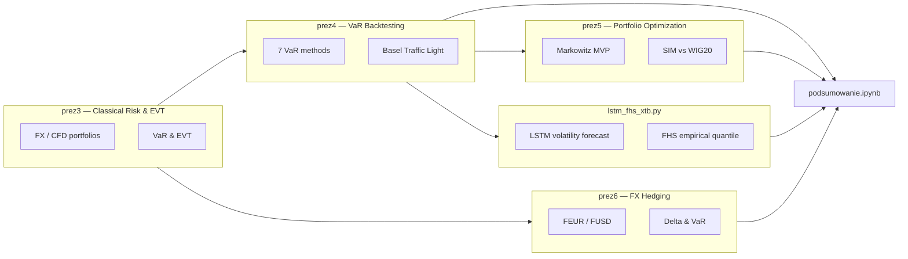

**LSTM-FHS pipeline:**

```
VaR_α,t+1 = −σ̂_LSTM(t+1) · Q_α(z)
```

An LSTM(32) network forecasts log|return| from 6 features (log-returns, volume, EWMA, σ_close, etc.), while `Q_α(z)` is the empirical quantile of standardized FHS residuals. Rolling refit every 90 days with grid search over (WINDOW × LAMBDA_EWMA × SIGMA_FLOOR). Supports **Apple MPS** / CPU.

---

## Visual Summary

Key charts are extracted from `podsumowanie.ipynb` and `prez6.ipynb` (run the notebooks to regenerate them).

### Return Series Characteristics

Price path, daily log-returns, fitted distributions, and Q-Q plot for XTB.WA (2018–2025). Fat left tails and volatility clustering are visible throughout.

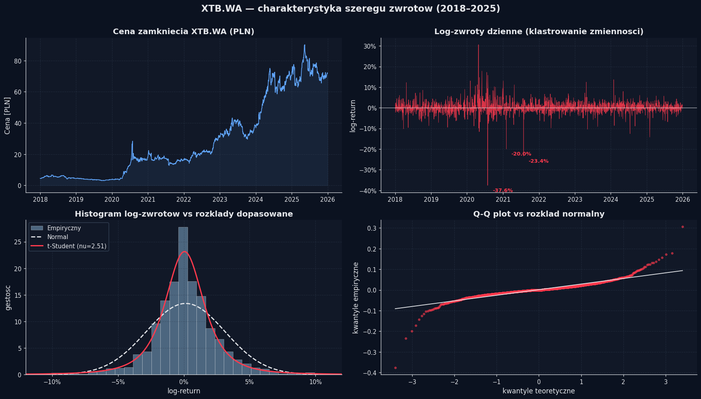

### Distribution Fit (Kolmogorov–Smirnov Test)

No parametric distribution adequately describes XTB.WA log-returns; Johnson SU and Student's *t* provide the closest fit.

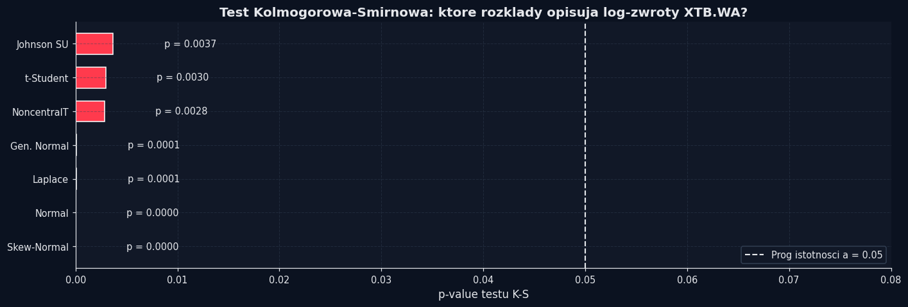

### VaR, ES, and EVaR Comparison

Side-by-side comparison of risk measures at 95% and 99% confidence levels (full sample).

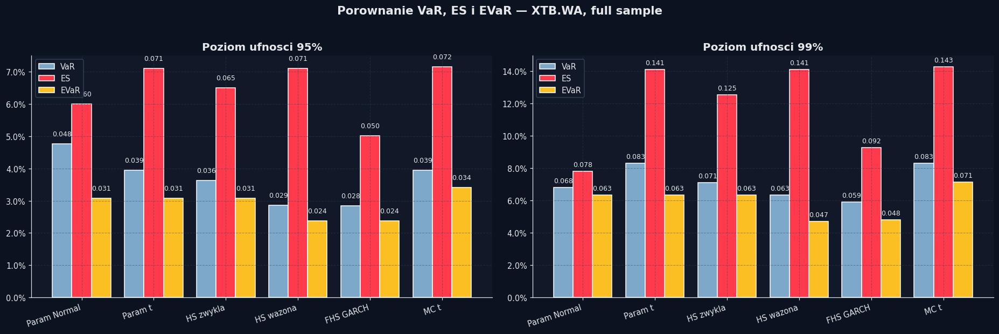

### Rolling VaR 99% Backtest

Three best-performing methods (FHS GARCH, EWMA + Hill, LSTM-FHS) vs. actual returns. Rolling window W = 500 days.

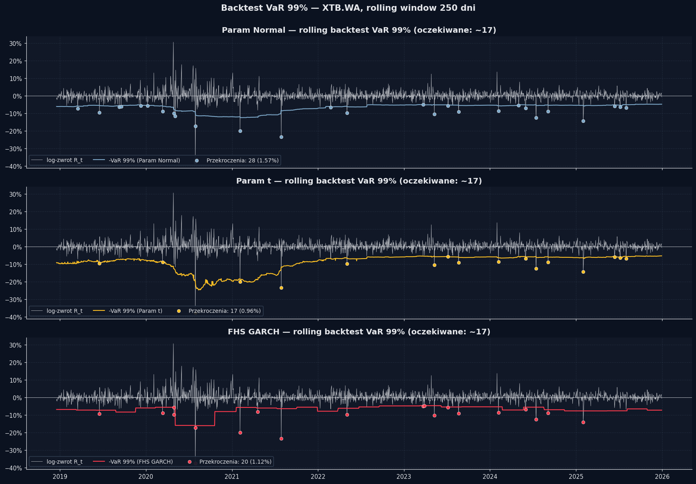

### Basel Traffic Light

Annual VaR 99% breach counts by method, color-coded by Basel zone (green / yellow / red).

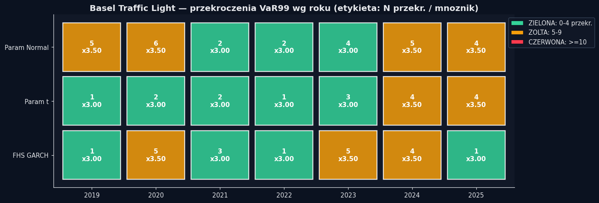

### Extreme Value Theory (EVT)

Block Maxima → GEV, Peaks Over Threshold → GPD, and mean excess plot for tail modeling.

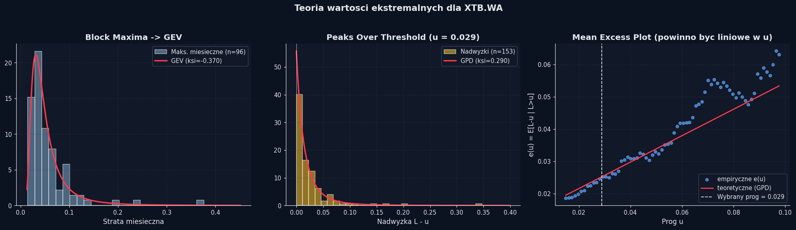

### LSTM-FHS Dynamic VaR

Rolling volatility forecast (σ_{t+1}) and dynamic VaR vs. out-of-sample log-returns.

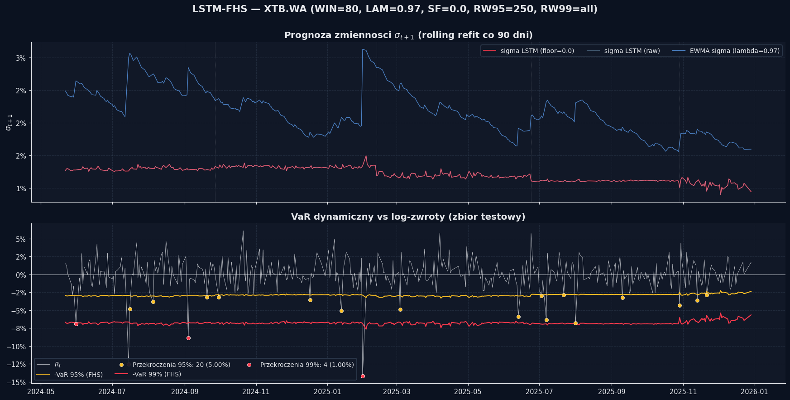

### Markowitz Efficient Frontier (13 GPW Stocks)

Efficient frontier for a 1M PLN allocation across 13 Warsaw-listed equities.

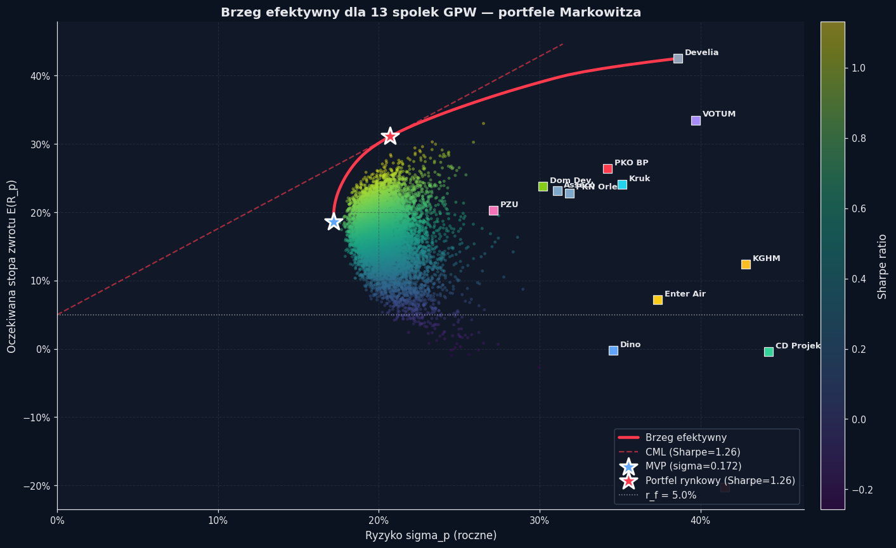

### Portfolio Allocation: MVP vs. Market Portfolio

Capital weights for the minimum-variance portfolio (MVP) and maximum-Sharpe market portfolio.

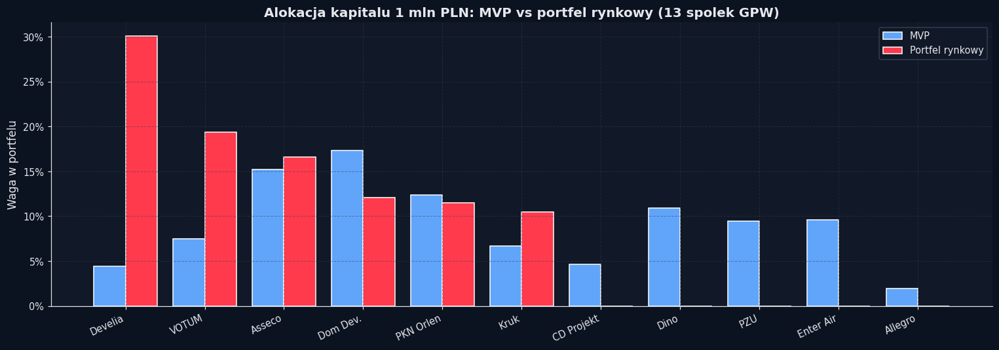

### FX Hedging Strategy (EUR/PLN + USD/PLN)

Cumulative P&L, daily loss distribution, rolling VaR, and cross-currency correlation before and after hedging with FEUR/FUSD futures.

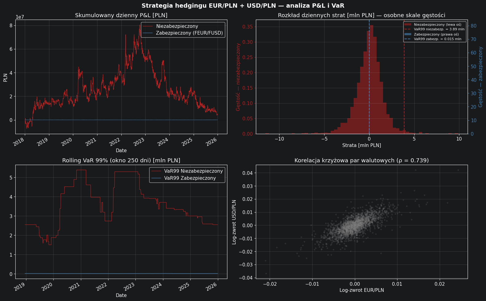

### Hedging Cost vs. Unhedged Losses

Annual hedging costs compared to potential FX losses without protection.

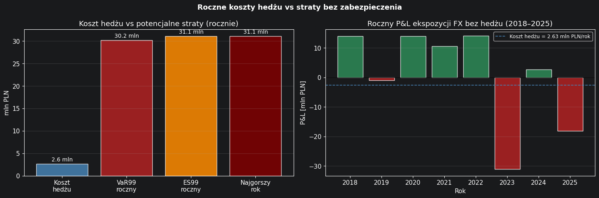

---

## Repository Structure

```
Enterprise-Risk-Management/
├── prez3.ipynb              # Project 1: risk measures, FX/CFD portfolios, EVT
├── prez4.ipynb              # Project 2: VaR/EVaR, backtesting, FHS GARCH, EWMA+Hill
├── prez5.ipynb              # Project 3: Markowitz portfolio optimization (13 GPW stocks)
├── prez6.ipynb              # Project 4: FX hedging (FEUR/FUSD), Delta, strategy VaR
├── podsumowanie.ipynb       # Integrated results + report-style charts
├── lstm_fhs_xtb.py          # LSTM + FHS (empirical residual quantile)
├── wig20_d.csv              # Daily WIG20 quotes (stooq.pl, 2021–2025)
├── docs/images/             # Key figures referenced in this README
├── requirements.txt
├── .gitignore
└── README.md
```

---

## Methods and Scope

### `prez3.ipynb` — Classical Risk Measures and EVT

- **Variables:** EUR/PLN, USD/PLN, GBP/PLN, XTB.WA
- Volatility measures (σ, variance, IQR, MAD), VaR quantiles (empirical and parametric)
- FX portfolio (50/30/20) and CFD portfolio (gold, S&P 500, NASDAQ-100)
- **EVT:** Block Maxima (GEV) and Peaks Over Threshold (GPD)
- Backtesting: Kupiec and Christoffersen tests

### `prez4.ipynb` — VaR, EVaR, and Regulatory Backtesting

- **7 VaR methods:** Parametric Normal, Parametric *t*, plain HS, weighted HS (BRW), FHS GARCH, EWMA + Hill, MC *t* / ARMA-GARCH
- **EVaR** and **Expected Shortfall (ES)**
- Rolling backtest (W = 500 days, period 2020–2025)
- Tests: **Kupiec**, **Christoffersen**, **Berkowitz**, **Basel Traffic Light**
- Bootstrap confidence intervals for VaR

### `prez5.ipynb` — Markowitz Portfolio Optimization

- **1M PLN** allocation across 13 GPW stocks (PKO BP, PKN Orlen, KGHM, CD Projekt, Dino, VOTUM, KRUK, PZU, Enter Air, Develia, Dom Development, Allegro, Asseco)
- Minimum-variance portfolio (MVP), market portfolio (max Sharpe), efficient frontier
- Monte Carlo cloud of 10,000 random portfolios (Dirichlet distribution)
- Single-index model (SIM) with β vs. WIG20 (data from `wig20_d.csv`)
- Constraint: annual 99% VaR ≤ 20%

### `prez6.ipynb` — FX Risk Hedging

- Net exposure: **50M EUR** and **30M USD** (revenue structure from `prez3`)
- Instruments: **FEUR** and **FUSD** futures on GPW (NBP fixing, KDPW clearing)
- Minimum-variance hedge ratio, contract count, initial margin and variation margin
- Sensitivity: **Delta**, P&L under ±1% moves
- **1-day 99% VaR** before and after hedge: HS, parametric, Student's *t* + **ES**
- Roll costs, basis risk, and stress scenarios (±3σ)

### `lstm_fhs_xtb.py` — Hybrid LSTM Model

Standalone script implementing the LSTM + FHS pipeline described above. Downloads data from Yahoo Finance, trains the network, and runs Kupiec/Christoffersen backtests.

### `podsumowanie.ipynb` — Integration

Combines results from `prez3`–`prez5` and the LSTM model into a unified dark-theme report with consistent XTB branding.

---

## Requirements

- Python **3.10+**
- Jupyter Notebook / JupyterLab

| Package | Purpose |
|---------|---------|
| `numpy`, `pandas` | Computation, time series |
| `yfinance` | GPW / Yahoo Finance data |
| `matplotlib` | Visualization |
| `scipy` | Statistics, optimization, distributions |
| `scikit-learn` | Feature scaling (LSTM) |
| `torch` | LSTM networks |
| `arch` | GARCH models (`prez4`, `podsumowanie`) |

Full list in [`requirements.txt`](requirements.txt).

---

## Installation and Usage

```bash
# Clone the repository
git clone https://github.com/michalmarchwiak/Enterprise-Risk-Management.git
cd Enterprise-Risk-Management

# Virtual environment (recommended)
python -m venv .venv
source .venv/bin/activate        # Linux / macOS
# .venv\Scripts\activate         # Windows

# Install dependencies
pip install -r requirements.txt
```

> **PyTorch:** On macOS with Apple Silicon, the PyPI `torch` package usually detects MPS automatically. For installation issues, see [pytorch.org](https://pytorch.org/get-started/locally/).

### Notebooks

```bash
jupyter notebook podsumowanie.ipynb   # full summary (recommended starting point)
jupyter notebook prez4.ipynb          # VaR and backtesting
jupyter notebook prez5.ipynb          # portfolio optimization
jupyter notebook prez6.ipynb          # FX hedging with FEUR/FUSD
```

### LSTM Model

```bash
python lstm_fhs_xtb.py
```

> **Note:** The LSTM script downloads data from Yahoo Finance and trains the network. The first run may take several minutes (GPU/MPS accelerates training).

---

## Data Sources

| Source | Content | Period |
|--------|---------|--------|
| Yahoo Finance (`yfinance`) | XTB.WA, GPW stocks, FX rates (EUR/PLN, USD/PLN) | 2018–2025 |
| `wig20_d.csv` (local, [stooq.pl](https://stooq.pl)) | Daily WIG20 OHLCV | 2021–2025 |
| GPW | FEUR / FUSD futures specification (NBP fixing) | — |

Main analytical sample: **n = 2030** daily log-return observations for XTB.WA (2018-01-01 – 2025-12-30).

---

## Author

**Michał Marchwiak**  
Summer semester 2025/2026 — Enterprise Risk Management

---

## License

Academic project — code and materials are shared for educational purposes only. Market data comes from public sources (Yahoo Finance, GPW, stooq.pl) and is subject to those services' terms of use.
